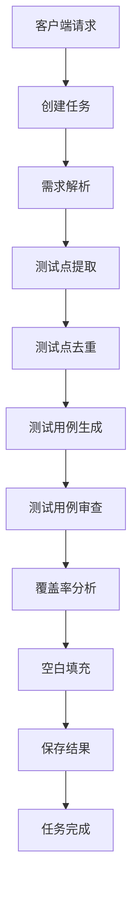

# AITestCraft

AITestCraft 是一个基于 AI 的测试用例生成和管理系统，通过自动化流程从需求文档生成高质量的测试用例。

---

## 项目结构

```
AITestCraft/
├── agents/           # 代理相关代码
│   ├── base.py       # 代理基类与客户端单例
│   └── prompts.py    # Prompt 模板定义
├── api/              # API 接口实现
│   ├── endpoints/    # API 端点定义
│   │   ├── tasks.py      # 任务管理接口
│   │   └── rate_limit.py # 限流管理接口
│   ├── rate_limiter.py   # 限流器实现
│   ├── schemas.py    # 数据模型定义
│   └── main.py       # API 主入口
├── config/           # 配置文件
│   └── config.py     # 核心配置类
├── core/             # 核心功能
│   ├── workflow.py   # 工作流引擎
│   ├── taskexecution.py  # 任务执行模块
│   ├── node.py       # 工作流节点
│   ├── context.py    # 工作流上下文
│   ├── retry.py      # 重试策略
│   └── schemas.py    # JSON Schema 定义
├── logs/             # 日志文件
├── skills/           # 技能模块
│   ├── gap-filler/           # 测试用例空白填充
│   ├── requirement-parser/   # 需求文档解析
│   ├── testcase-coverage/    # 测试用例覆盖率分析
│   ├── testcase-generator/   # 测试用例生成
│   ├── testcase-reviewer/    # 测试用例审查
│   ├── testpoint-deduplicator/ # 测试点去重
│   └── testpoint-extractor/  # 测试点提取
├── storage/          # 存储相关
│   └── db.py         # 数据库操作
├── utils/            # 工具函数
│   ├── logger.py     # 日志工具
│   ├── json_utils.py # JSON 处理工具
│   └── exceptions.py # 自定义异常
├── .env              # 环境变量
├── .gitignore        # Git 忽略配置
├── main.py           # API 主入口文件
├── run_task.py       # 命令行任务运行入口
├── pyproject.toml    # 项目依赖配置
├── uv.lock           # 依赖锁文件
└── workflow.db       # SQLite 数据库文件
```

---

## 核心功能

| 功能模块 | 说明 |
|---------|------|
| **需求解析** | 自动解析需求文档，提取关键信息 |
| **测试点提取** | 从需求中提取测试点 |
| **测试点去重** | 去除重复的测试点 |
| **测试用例生成** | 基于测试点生成测试用例 |
| **测试用例审查** | 对生成的测试用例进行审查 |
| **测试用例覆盖率分析** | 分析测试用例的覆盖率 |
| **测试用例空白填充** | 填充测试用例中的空白部分 |

---

## 技术栈

| 分类 | 技术 | 版本要求 |
|------|------|---------|
| **后端语言** | Python | 3.11+ |
| **Web 框架** | FastAPI | 最新 |
| **数据库** | SQLite | 内置 |
| **依赖管理** | UV | 最新 |
| **AI 框架** | agent_framework | - |

---

## 快速开始

### 1. 安装依赖

```bash
# 使用 UV 安装依赖
uv install
```

### 2. 配置环境变量

复制 `.env.example` 到 `.env` 文件，设置必要的环境变量：

```bash
cp .env.example .env
```

编辑 `.env` 文件：

```ini
# OpenAI 配置
OPENAI_API_KEY=your_api_key_here
OPENAI_CHAT_MODEL_ID=gpt-4o-mini
OPENAI_BASE_URL=https://api.openai.com/v1

# 服务器配置
SERVER_HOST=0.0.0.0
SERVER_PORT=8000

# 限流配置
API_RATE_LIMIT_PER_MINUTE=60

# 日志配置
LOG_LEVEL=INFO
```

### 3. 启动服务

```bash
# 方式一：使用主入口
python main.py

# 方式二：直接运行 API
uv run python -m uvicorn api.main:app --host 0.0.0.0 --port 8000 --reload
```

服务将在 `http://0.0.0.0:8000` 启动，访问 `http://localhost:8000/docs` 可查看 API 文档。

---

## API 接口

### 1. 运行任务

**POST** `/run`

提交测试用例生成任务。

**请求体**：
```json
{
  "task": "你的需求文档内容，支持纯文本格式"
}
```

**响应**：
```json
{
  "task_id": "550e8400-e29b-41d4-a716-446655440000"
}
```

### 2. 查询任务状态

**GET** `/status/{task_id}`

**响应**：
```json
{
  "task_id": "550e8400-e29b-41d4-a716-446655440000",
  "status": "completed",
  "created_at": "2024-01-15T10:30:00",
  "updated_at": "2024-01-15T10:35:00"
}
```

**状态说明**：
- `pending` - 等待执行
- `running` - 执行中
- `completed` - 已完成
- `failed` - 执行失败

### 3. 获取任务结果

**GET** `/result/{task_id}`

**响应**：
```json
{
  "task_id": "550e8400-e29b-41d4-a716-446655440000",
  "result": "{\"testcases\": [...], \"coverage\": 95}",
  "status": "completed"
}
```

### 4. 获取任务日志

**GET** `/logs/{task_id}`

**响应**：
```json
{
  "task_id": "550e8400-e29b-41d4-a716-446655440000",
  "logs": [
    {"timestamp": "2024-01-15T10:30:00", "level": "INFO", "message": "任务开始执行"}
  ],
  "total": 10
}
```

### 5. 健康检查

**GET** `/health`

**响应**：
```json
{
  "status": "healthy"
}
```

---

## 工作流程



**详细流程说明**：

1. **需求解析**：解析用户输入的需求文档，提取关键信息
2. **测试点提取**：从需求中提取测试点，包括正常场景和边界条件
3. **测试点去重**：去除重复或冗余的测试点
4. **测试用例生成**：基于测试点生成详细的测试用例
5. **测试用例审查**：对生成的测试用例进行质量审查
6. **覆盖率分析**：分析测试用例对需求的覆盖程度
7. **空白填充**：填充测试用例中的缺失部分
8. **结果保存**：将最终结果保存到数据库

---

## 技能模块

### requirement-parser
- **功能**：解析需求文档，提取关键信息
- **输入**：需求文档文本
- **输出**：结构化的需求信息

### testpoint-extractor
- **功能**：从需求中提取测试点
- **输入**：解析后的需求信息
- **输出**：测试点列表

### testpoint-deduplicator
- **功能**：去除重复的测试点
- **输入**：测试点列表
- **输出**：去重后的测试点列表

### testcase-generator
- **功能**：基于测试点生成测试用例
- **输入**：测试点列表
- **输出**：测试用例列表

### testcase-reviewer
- **功能**：对生成的测试用例进行审查
- **输入**：测试用例列表
- **输出**：审查后的测试用例

### testcase-coverage
- **功能**：分析测试用例的覆盖率
- **输入**：需求信息和测试用例
- **输出**：覆盖率报告

### gap-filler
- **功能**：填充测试用例中的空白部分
- **输入**：测试用例列表
- **输出**：完整的测试用例

---

## 配置说明

配置文件位于 `config/config.py`，支持以下环境变量：

| 环境变量 | 说明 | 默认值 |
|---------|------|--------|
| `SERVER_HOST` | 服务器地址 | `0.0.0.0` |
| `SERVER_PORT` | 服务器端口 | `8000` |
| `OPENAI_API_KEY` | OpenAI API Key | - |
| `OPENAI_CHAT_MODEL_ID` | 模型名称 | `gpt-4o-mini` |
| `OPENAI_BASE_URL` | API 基础地址 | `https://api.openai.com/v1` |
| `API_RATE_LIMIT_PER_MINUTE` | 每分钟请求限制 | `60` |
| `LOG_LEVEL` | 日志级别 | `INFO` |
| `MAX_FILE_SIZE` | 最大文件大小 | `10MB` |

---

## 日志

系统日志存储在 `logs/AITestCraft.log` 文件中，包含以下级别：

- **DEBUG**：详细调试信息
- **INFO**：常规运行信息
- **WARNING**：警告信息
- **ERROR**：错误信息

---

## 数据库

系统使用 SQLite 数据库存储任务信息，数据库文件为 `workflow.db`，包含以下表：

| 表名 | 说明 |
|------|------|
| `tasks` | 任务信息表 |
| `logs` | 任务日志表 |

---

## 命令行运行

除了通过 API 调用，也可以直接通过命令行运行任务：

```bash
python run_task.py
```

---

## 许可证

MIT License

---

## 贡献

欢迎提交 Issue 和 Pull Request！

